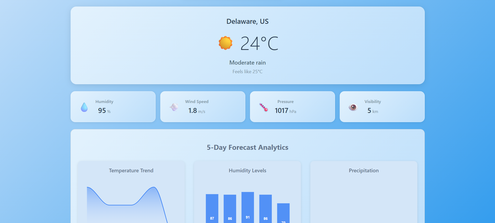

# Weather Dashboard Challenge

Weather dashboard built with [Vue 3](https://vuejs.org/) + [Vite](https://vitejs.dev/), using the [OpenWeatherMap API](https://openweathermap.org/api). The application allows users to search for any city and view current weather conditions along with a 5-day forecast.

## The frontend-challenge branch contains the code for the mandatory part of the challenge.



## Technologies Used

- Vue 3
- Vite
- Axios
- OpenWeatherMap API

## How to Use:

### 1. Clone the repository

```bash
git clone https://github.com/YOUR_USERNAME/weather-dashboard.git
```

### 2. Cd into weather-dashboard

```bash
cd weather-dashboard
```

### 3. Make sure you're on the right branch

```bash
git checkout frontend-challenge
```

### 4. Install Dependencies
#### Recommended version: Node.js v22.11.0 or later
```bash
npm install
```

### 5. Run the project

```bash
npm run dev
```
