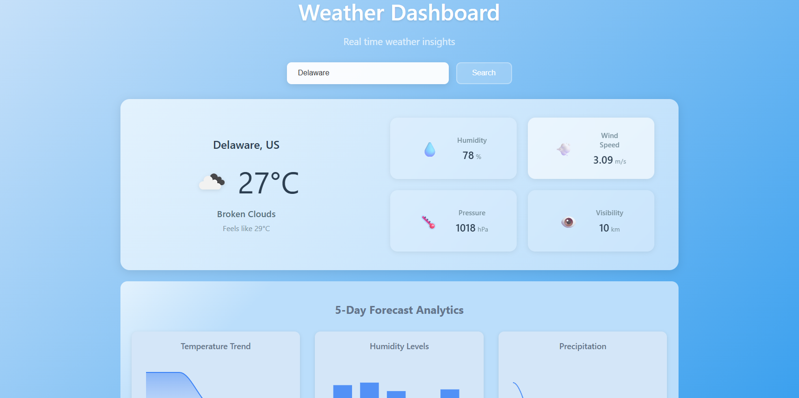

# Weather Dashboard Challenge
## Frontend Mandatory Challenge Branch

Weather dashboard built with Vue.js+ Vite, using the [OpenWeatherMap API](https://openweathermap.org/api). The application allows users to search for any city and view current weather conditions along with a 5-day forecast.

### The main branch contains the code for the mandatory part of the challenge.
### The backend-challenge branch contains the code for the optional backend challenge.



## How to Use:
### ⚠️ Note: Make sure you use a valid [OpenWeatherMap API](https://openweathermap.org/api) key on your .env file, folow the .env.example file for reference. 
### ⚠️ Use Node.js v22.11.0 or later 

### 1. Clone the repository

```bash
git clone https://github.com/YOUR_USERNAME/weather-dashboard.git
```
### 2. Make sure you're on the right branch
#### In this case, the mandatory part is on the main branch

### 3. Install dependencies
#### Required version: Node.js v22.11.0 or later

```bash
cd weather-dashboard
npm install
```

### 4. Run the project (/weather-dashboard)

```bash
npm run dev
```
